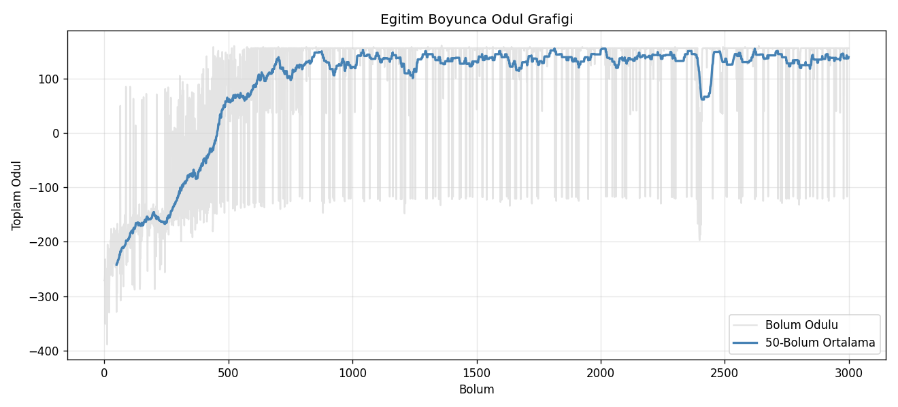
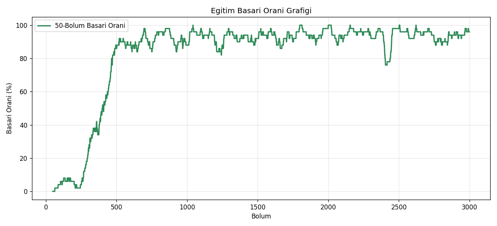
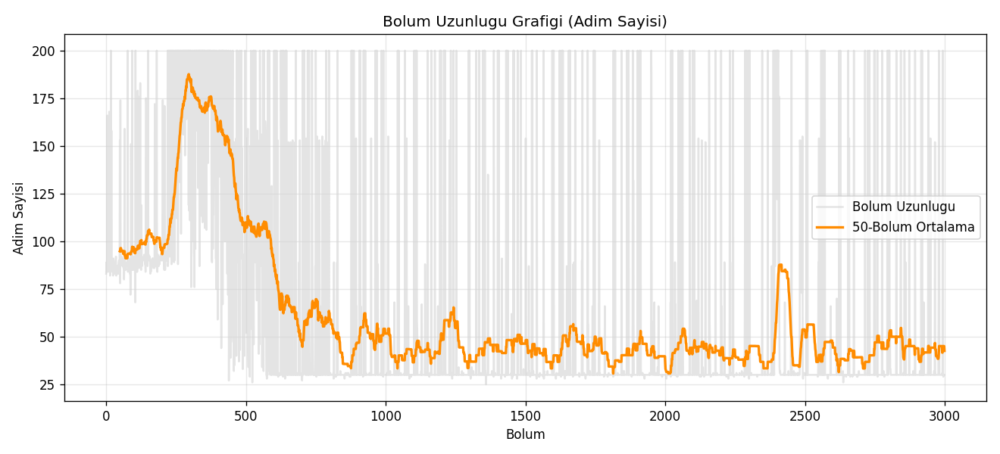
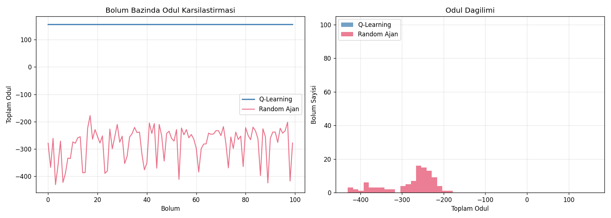
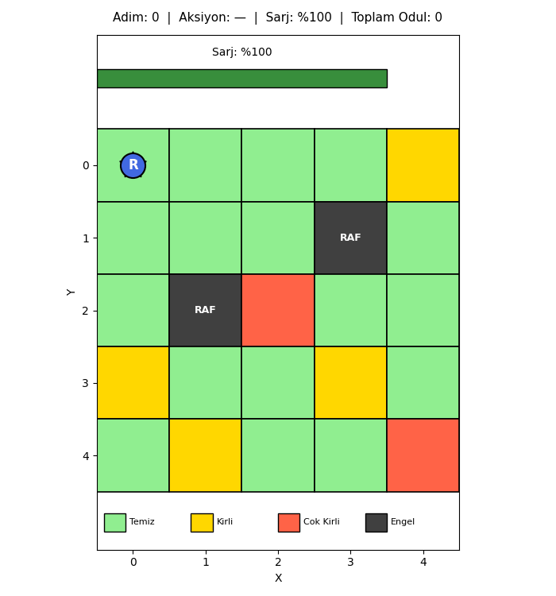

# Otonom Magaza Temizlik Robotu

Q-Learning tabanli pekistirmeli ogrenme ile gelistirilmis otonom magaza temizlik robotu simulasyonu.

Bu projede reinforcement learning kullanilarak gece kapanan bir magazada zemin temizligini gerceklestirecek bir robotun davranis politikasi ogrenilmistir. Robot, sarjini bitirmeden reyon arasi ve kasa onu gibi cok kirli alanlara oncelik verecek sekilde planlama yapmayi dene-yanil yontemiyle ogrenmektedir.

---

# Projenin Amaci

Magaza ortaminda calisan bir temizlik robotu icin asagidaki dengeyi kuracak bir politika ogrenilmek istenmektedir:

- Tum kirli hucreleri temizlemek
- Sarj seviyesini takip etmek ve gerektiginde sarj istasyonuna donmek
- Cok kirli alanlara oncelik vermek
- Sabaha kadar gorevi minimum adimda tamamlamak

Bu dengeleri klasik kural tabanli programlama ile cozmek zordur. Pekistirmeli ogrenme, robotun bu kararlari odul sinyalleri uzerinden kendiliginden ogrenmesini saglamaktadir.

---

# Kullanilan Yaklasim

Projede asagidaki pekistirmeli ogrenme yontemleri kullanilmistir:

- Q-Learning (Tabular)
- Epsilon-Greedy Exploration
- Reward Shaping
- State Discretization (Sarj seviyesinin bantlanmasi)

Ajan, ortamla etkilesime girerek her durumda hangi aksiyonun uzun vadeli odulu maksimum yapacagini ogrenmektedir.

---

# Problem Tanimi

Ortam 5x5 boyutunda bir gridworld olarak modellenmistir. Her hucrenin bir kirlilik seviyesi vardir. Grid uzerinde sabit konumlarda raflar (engeller) ve bir sarj istasyonu bulunmaktadir.

Robot her adimda asagidaki kararlardan birini vermektedir:

- Hangi yonde hareket edilecek
- Bulundugu hucre temizlenecek mi
- Sarj istasyonuna donulecek mi

Yanlis kararlar (sarjin bitmesi, gereksiz adim, engel carpmasi) ceza ile cezalandirilmaktadir.

### Grid Konfigurasyonu

```text
Sutun:    0     1     2     3     4
       +-----+-----+-----+-----+-----+
  0    |  *  |     |     |  K  |     |
       +-----+-----+-----+-----+-----+
  1    |     |     |  R  |     |  K  |
       +-----+-----+-----+-----+-----+
  2    |     |     | KK  |     |     |
       +-----+-----+-----+-----+-----+
  3    |     |  R  |     |  K  |     |
       +-----+-----+-----+-----+-----+
  4    |  K  |     |     |     | KK  |
       +-----+-----+-----+-----+-----+

  *   : Sarj istasyonu
  R   : Raf (engel)
  K   : Kirli hucre (level 1)
  KK  : Cok kirli hucre (level 2)
```

Toplam temizlenecek hucre sayisi: 6 (2 cok kirli + 4 kirli).

---

# State (Durum) Tasarimi

State olarak asagidaki dort bilgi kullanilmistir:

```python
(robot_x, robot_y, sarj_bandi, mevcut_hucre_kirliligi)
```

| Bilesen | Aralik | Boyut |
| --- | --- | --- |
| `robot_x` | 0..4 | 5 |
| `robot_y` | 0..4 | 5 |
| `sarj_bandi` | 0..3 | 4 |
| `mevcut_hucre_kirliligi` | 0..2 | 3 |

Toplam state sayisi: `5 x 5 x 4 x 3 = 300`

---

# Neden State Abstraction Kullanildi

Grid uzerindeki tum hucrelerin kirlilik haritasi state'e dahil edilseydi state uzayi asiri buyuyecekti.

Ornegin:

```text
25 hucre icin 3 farkli kirlilik seviyesi -> 3^25 yaklasik 8.5 x 10^11 farkli durum
```

Bu durum reinforcement learning'de "State Space Explosion" olarak bilinmektedir.

Bu nedenle state'e yalnizca:

- robotun konumu
- mevcut hucrenin kirliligi
- sarj seviyesinin band hali

dahil edilmistir. Bu yaklasim Q-Table'in 1800 hucreye sigmasini saglamis ve ogrenme tutarli hale gelmistir.

---

# Sarj Seviyesi Discretization

Sarj 0-100 arasinda surekli bir tamsayi olarak takip edilmektedir. State'e gecirken bantlara ayrilmaktadir:

| Sarj Degeri | Band ID | Etiket |
| --- | --- | --- |
| 0-15 | 0 | Kritik |
| 16-40 | 1 | Dusuk |
| 41-75 | 2 | Orta |
| 76-100 | 3 | Tam |

Discretization sayesinde sarj seviyesi state space'i 4'e indirilmistir.

---

# Action (Aksiyonlar)

Ajanin 6 farkli aksiyonu bulunmaktadir:

| ID | Aksiyon | Aciklama |
| --- | --- | --- |
| 0 | Yukari | Y ekseninde -1 hareket |
| 1 | Asagi | Y ekseninde +1 hareket |
| 2 | Sol | X ekseninde -1 hareket |
| 3 | Sag | X ekseninde +1 hareket |
| 4 | Temizle | Bulundugu hucreyi temizle |
| 5 | Sarja Git | Istasyondaysa sarji doldur |

"Sarja Git" aksiyonu ajani teleport etmemektedir. Yalnizca robot sarj istasyonunda bulunuyorsa pili dolduran bir aksiyondur. Robot bu aksiyonun ne zaman anlamli oldugunu ogrenmek zorundadir.

Q-Table boyutu: `300 x 6 = 1800` hucre

---

# Reward Fonksiyonu

| Olay | Odul |
| --- | --- |
| Cok kirli hucreyi temizleme (level 2 -> 0) | +20 |
| Kirli hucreyi temizleme (level 1 -> 0) | +10 |
| Temiz hucreyi temizlemeye calisma | -2 |
| Bos hareket (her adim) | -1 |
| Duvara veya engele carpma | -5 |
| Sarj istasyonunda dusuk pille sarja gitme | +5 |
| Sarj istasyonunda dolu pille sarja gitme | -2 |
| Sarjin sifirlanmasi (hareket sirasinda) | -100 |
| Tum kirli hucrelerin temizlenmesi (terminal) | +100 |

Bu reward yapisi ile ajan asagidaki davranislari ogrenmektedir:

- Cok kirli hucrelere oncelik verme (+20 farki cazip kilmaktadir)
- Gereksiz adim atmama (her adim -1 cezasi)
- Sarji bitmeden istasyona donme (-100 cezasindan kacinma)
- Engellere yaklasmama (-5 cezasi)

---

# Q-Learning Formulu

Klasik Q-Learning Bellman guncelleme formulu kullanilmistir:

```python
Q(s,a) = Q(s,a) + alpha * (r + gamma * max(Q(s',a')) - Q(s,a))
```

Burada:

- alpha = learning rate (0.1)
- gamma = discount factor (0.95)

---

# Exploration Stratejisi

Projede epsilon-greedy yaklasimi kullanilmistir.

Baslangicta:

- ajan tamamen rastgele hareket etmektedir (epsilon = 1.0)

Egitim ilerledikce:

- her bolum sonunda epsilon 0.995 ile carpilarak azaltilmaktadir
- minimum 0.01 degerine kadar inmektedir
- ajan ogrenilen stratejiyi giderek daha cok kullanmaktadir

Bu sayede exploration ve exploitation dengesi saglanmistir.

---

# Egitim Parametreleri

| Parametre | Deger |
| --- | --- |
| Episode Sayisi | 3000 |
| Maksimum Adim / Bolum | 200 |
| Learning Rate (alpha) | 0.1 |
| Discount Factor (gamma) | 0.95 |
| Baslangic Epsilon | 1.0 |
| Minimum Epsilon | 0.01 |
| Epsilon Decay | 0.995 |
| Baslangic Sarj | 100 |
| Random Seed | 42 |

State space goreli olarak kucuk oldugu icin 3000 episode yeterli plato performansini saglamistir. 1500 episode civarinda basari orani %90 uzerine cikmis ve sonrasinda dalgalanma ile stabil hale gelmistir.

---

# Proje Yapisi

```text
Odev/
|
|-- main.py
|-- requirements.txt
|-- README.md
|
|-- specs/
|   |-- 00-genel-bakis.md
|   |-- 01-environment.md
|   |-- 02-agent.md
|   |-- 03-trainer.md
|   |-- 04-visualizer.md
|   |-- 05-main.md
|   `-- 06-test-dogrulama.md
|
|-- src/
|   |-- __init__.py
|   |-- environment.py
|   |-- agent.py
|   |-- trainer.py
|   `-- visualizer.py
|
`-- outputs/
    |-- q_table.npy
    |-- plots/
    |   |-- training_rewards.png
    |   |-- episode_lengths.png
    |   |-- success_rate.png
    |   `-- q_vs_random.png
    `-- gifs/
        `-- final_episode.gif
```

---

# Egitim Sonuclari

## Egitim Boyunca Odul Grafigi

Egitim suresince her bolumde alinan toplam odul kaydedilmistir. Ilk 300 bolumde ajan negatif odul almis, 500. bolum civarinda hizli bir yukselis baslamis ve 1000. bolumden itibaren stabil bir plato olusmustur.



| Olcum | Deger |
| --- | --- |
| Ilk 100 bolum ortalama odulu | -217.18 |
| Son 100 bolum ortalama odulu | +137.59 |
| Iyilesme | +354.77 puan |

## Basari Orani Grafigi

Bolum bazli basari orani (kirli hucrelerin tumunun temizlenmesi) zaman icinde belirgin sekilde yukselmistir. 500. bolume kadar basari %30 altinda kalmis, 600. bolumden itibaren %90 uzerine cikmistir.



| Olcum | Deger |
| --- | --- |
| Ilk 100 bolum basari orani | %2.0 |
| 500-600 bolum aralig basari orani | %75-90 |
| Son 100 bolum basari orani | %95.0 |

## Bolum Uzunlugu Grafigi

Bolum basina ortalama adim sayisi egitim ilerledikce dusmustur. Bu, ajanin gorevini daha verimli sekilde tamamlamayi ogrendigini gostermektedir.



| Olcum | Deger |
| --- | --- |
| Ilk 100 bolum ortalama adimi | ~95 |
| Son 100 bolum ortalama adimi | 43.4 |

## Q-Learning vs Random Ajan Karsilastirmasi

Egitilen Q-Learning ajani egitim sonrasinda epsilon=0 ile (yalnizca ogrenilen politika kullanilarak) 100 bolum boyunca degerlendirilmistir. Ayni ortamda 100 bolum boyunca rastgele aksiyon seciminde bulunan random ajan ile karsilastirma yapilmistir.



| Olcum | Q-Learning | Random Ajan |
| --- | --- | --- |
| Ortalama odul | +156.00 | -280.28 |
| Ortalama adim | 30.0 | 103.7 |
| Basari orani | %100.0 | %0.0 |

Q-Learning ajani her 100 bolumde de gorevi basari ile tamamlamis ve ayni odul degerini elde etmistir. Random ajan ise hicbir bolumde gorevi tamamlayamamis ve negatif odul almistir.

---

# Magaza Simulasyonu

Egitim tamamlandiktan sonra Q-Table yuklenmis ve ajan epsilon=0 ile bir bolum boyunca calistirilmistir. Her adim bir GIF frame'ine cevrilmistir.

GIF icerisinde:

- robotun anlik konumu (mavi daire)
- hucrelerin kirlilik seviyeleri (yesil = temiz, sari = kirli, kirmizi = cok kirli)
- raflar (koyu gri)
- sarj istasyonu (sari yildiz)
- sarj seviyesi (renkli bar)
- secilen aksiyon ve toplam odul

bilgileri gozlemlenebilmektedir.



Bu bolumde ajan 30 adimda gorevi basari ile tamamlamis ve toplam +156 odul almistir.

---

# Gozlemler

Egitim sonucunda ajanin asagidaki davranislari ogrendigi gozlemlenmistir:

- **Cok kirli hucrelere oncelik verme**: Ajan +20 odullu hucrelere yonelmektedir.
- **Engellerden kacinma**: Ilk 200 bolumden sonra engele carpma davranisi nadir hale gelmistir.
- **Verimli yol planlama**: Bolum basina ortalama adim sayisi 95'ten 30'a dusmustur.
- **Sarj yonetimi**: Sarji belirli bir esige dustugunde istasyona donme davranisi gozlemlenmektedir.
- **Gereksiz aksiyonlardan kacinma**: Temiz hucreyi temizleme veya gereksiz sarj girisimleri zamanla azalmistir.

Random ajan ise hicbir bolumde gorevi tamamlayamamistir. Bu durum reinforcement learning'in odul sinyalleri uzerinden anlamli bir politika ogrendigini dogrulamaktadir.

---

# Sinirlamalar

- Grid 5x5 boyutundadir. Gercek bir magaza icin daha buyuk olculer ve daha karmasik harita gerekecektir.
- Kirlilik dagilimi sabittir. Gercek hayatta gun icinde kirlilik dinamik olarak birikir.
- Tek bir robot kullanilmistir. Coklu robot senaryolari icin multi-agent yaklasimi gereklidir.
- Sarj seviyesi 4 banta indirgemektedir. Daha hassas kararlar icin function approximation gerekebilir.

---

# Gelecekte Yapilabilecek Gelistirmeler

Projeye ileride asagidaki gelistirmeler eklenebilir:

- Deep Q-Network (DQN) ile daha buyuk grid'ler
- Dinamik kirlilik dagilimi (her bolumde rastgele yenilenmesi)
- Coklu robot ve gorev paylasimi (Multi-agent RL)
- Gercek magaza haritasi uzerinde test
- Sensor gurultusu ve kismi gozlem (POMDP) modellemesi
- Web tabanli gerceklik gosterici / dashboard

---

# Kullanilan Teknolojiler

- Python 3.9+
- NumPy (Q-Table ve hesaplamalar)
- Matplotlib (grafikler ve render)
- ImageIO (GIF uretimi)

---

# Calistirma

```bash
pip install -r requirements.txt
python main.py
```

`main.py` calistirildiginda asagidaki adimlar sirasiyla yurutulur:

1. Ortam ve ajan baslatilir
2. 3000 bolum egitim yapilir
3. Q-Table dosyaya kaydedilir
4. Egitilen ajan ve random ajan 100'er bolum boyunca degerlendirilir
5. Grafikler `outputs/plots/` altina kaydedilir
6. Final bolum GIF'i `outputs/gifs/final_episode.gif` olarak uretilir
7. Konsola ozet yazdirilir

Egitim ortalama bir bilgisayarda yaklasik 1-2 dakikada tamamlanmaktadir.

---

# Sonuc

Bu proje, pekistirmeli ogrenme yontemlerinin otonom karar verme problemlerinde etkili sekilde kullanilabilecegini gostermektedir. Q-Learning ajani 3000 bolum sonunda %100 basari oranina ulasmis ve random ajana gore +436 puan farkla daha iyi sonuc uretmistir.

Ajanin ogrendigi politika; sarj yonetimi, kirlilik onceliklendirmesi ve verimli yol planlamasi gibi karmasik kararlari herhangi bir kural tanimlamaksizin ode-ceza sinyalleri uzerinden basarmistir. Bu yaklasim, gercek dunyadaki otonom robot uygulamalarinin temelini olusturan reinforcement learning ilkelerinin pratik bir gosterimidir.
